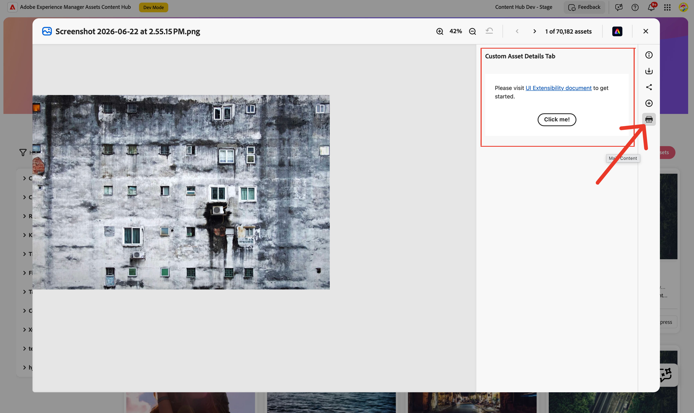

# Asset Details Tab Panels

Content Hub lets extensions add custom tab panels to the **Asset Details dialog** — the dialog that opens when a user clicks on an asset.



Custom tabs appear alongside the built-in tabs in the Asset Details dialog. Content Hub manages tab switching and lifecycle; the extension only provides tab metadata and the URL that renders the tab body.

Extensions use the `aem/assets/contenthub/1` extension point and implement the `assetDetails` namespace inside a single `register()` call.

## Host API Reference

In addition to the [Common APIs](../commons/index.md), the `assetDetails` namespace exposes one additional method on `guestConnection.host`:

### `assetDetails.getCurrentAsset()`

**Description:** Returns the identifier of the asset currently open in the Asset Details dialog.

**Returns** (`string`): Asset URN (e.g. `urn:aaid:aem:...`).

**Important:** `getCurrentAsset()` returns a **plain string**, not an object. Normalize it to `{ id }` so downstream code works consistently regardless of future API changes:

```js
const currentAssetId = await connection.host.assetDetails.getCurrentAsset();
const currentAsset = typeof currentAssetId === 'string'
  ? { id: currentAssetId }
  : currentAssetId;
```

## Extension API Reference

### `assetDetails` namespace

#### `assetDetails.getTabPanels()`

**Description:** Returns the list of custom tab panels to add to the Asset Details dialog.

**Returns** (`array`): Array of tab panel descriptor objects:
- `id` (`string`): Panel ID, unique within the extension.
- `tooltip` (`string`): Tooltip shown on the tab icon.
- `title` (`string`): Tab label text.
- `icon` (`string`): [React Spectrum workflow icon](https://react-spectrum.adobe.com/react-spectrum/workflow-icons.html#available-icons) name.
- `contentUrl` (`string`): Hash-relative URL to the panel content (e.g. `/#tab-panel`).

## Example

This example adds a **Asset Details Tab** that displays the current asset's URN and a button that shows a toast notification.

### `ExtensionRegistration.js` — registration

```js
import React from 'react';
import { Text } from '@adobe/react-spectrum';
import { register } from '@adobe/uix-guest';
import { extensionId } from './Constants';

function ExtensionRegistration() {
  const init = async () => {
    let guestConnection = await register({
      id: extensionId,
      methods: {
        assetDetails: {
          getTabPanels() {
            return [
              {
                id: 'tab-panel',
                tooltip: 'Asset Details Tab',
                icon: 'Extension',
                title: 'Asset Details Tab',
                contentUrl: '/#tab-panel',
              },
            ];
          },
        },
      },
    });
  };

  init().catch(console.error);
  return <Text>IFrame for integration with Host (Content Hub)...</Text>;
}

export default ExtensionRegistration;
```

### `App.js` — routing

```js
import React from 'react';
import { ErrorBoundary } from 'react-error-boundary';
import { HashRouter as Router, Routes, Route } from 'react-router-dom';
import ExtensionRegistration from './ExtensionRegistration';
import TabPanel from './TabPanel';

function App() {
  return (
    <Router>
      <ErrorBoundary onError={onError} FallbackComponent={fallbackComponent}>
        <Routes>
          <Route index element={<ExtensionRegistration />} />
          <Route path="index.html" element={<ExtensionRegistration />} />
          <Route path="tab-panel" element={<TabPanel />} />
        </Routes>
      </ErrorBoundary>
    </Router>
  );

  function onError(e, componentStack) {}
  function fallbackComponent({ componentStack, error }) {
    return (
      <React.Fragment>
        <h1 style={{ textAlign: 'center', marginTop: '20px' }}>Extension rendering error</h1>
        <pre>{componentStack + '\n' + error.message}</pre>
      </React.Fragment>
    );
  }
}

export default App;
```

### `TabPanel.js` — panel content

The panel component calls `attach()` to connect to Content Hub and retrieves the current asset. Note that `getCurrentAsset()` is **asynchronous** and returns a plain string — normalize it to `{ id }`.

```js
import React, { useState, useEffect } from 'react';
import { attach } from '@adobe/uix-guest';
import {
  Provider,
  defaultTheme,
  View,
  Heading,
  Text,
  Button,
  Divider,
  ProgressCircle,
} from '@adobe/react-spectrum';
import { extensionId } from './Constants';

export default function TabPanel() {
  const [guestConnection, setGuestConnection] = useState(null);
  const [asset, setAsset] = useState(null);
  const [loading, setLoading] = useState(true);

  useEffect(() => {
    (async () => {
      try {
        const connection = await attach({ id: extensionId });
        setGuestConnection(connection);

        // getCurrentAsset() returns a plain string (the asset URN).
        // Normalize to { id } for consistent downstream usage.
        const currentAssetId = await connection.host.assetDetails.getCurrentAsset();
        const currentAsset = typeof currentAssetId === 'string'
          ? { id: currentAssetId }
          : currentAssetId;
        setAsset(currentAsset);
      } finally {
        setLoading(false);
      }
    })();
  }, []);

  if (loading) {
    return (
      <Provider theme={defaultTheme}>
        <View padding="size-400" height="100vh"
          UNSAFE_style={{ display: 'flex', justifyContent: 'center', alignItems: 'center' }}>
          <ProgressCircle aria-label="Loading..." isIndeterminate />
        </View>
      </Provider>
    );
  }

  return (
    <Provider theme={defaultTheme}>
      <View padding="size-400">
        <Heading level={3}>Asset Details Tab</Heading>
        <Divider marginY="size-200" />
        {asset && (
          <View marginBottom="size-200">
            <Text><strong>Asset ID:</strong></Text>
            <View marginTop="size-100" padding="size-100" backgroundColor="gray-100" borderRadius="regular">
              <Text UNSAFE_style={{ fontFamily: 'monospace', fontSize: '12px', wordBreak: 'break-all' }}>
                {asset.id}
              </Text>
            </View>
          </View>
        )}
        <Button
          variant="accent"
          marginTop="size-300"
          onPress={() => guestConnection?.host.toast.display({ variant: 'positive', message: 'Action from Asset Details Tab!' })}
        >
          Show Toast
        </Button>
      </View>
    </Provider>
  );
}
```

## Calling a backend web action from the panel

To make AEM API calls from the panel, retrieve auth info from the host and call your Adobe I/O Runtime action:

```js
// Add this import at the top of TabPanel.js alongside the other imports:
import actions from '../config.json';

// Inside the useEffect, after attach():
const { accessToken, imsOrg } = await connection.host.auth.getIMSInfo();
const apiKey = await connection.host.auth.getApiKey();
const aemHost = await connection.host.discovery.getAemHost();

const response = await fetch(actions['aem-assets-contenthub-1/generic'], {
  method: 'POST',
  headers: { 'Content-Type': 'application/json' },
  body: JSON.stringify({ assetId: asset.id, aemHost, apiKey, imsOrg }),
});
const data = await response.json();
```

`config.json` is generated by the CLI template and contains the deployed web action URLs keyed by action name.

## Additional resources

- [Common Concepts](../commons/index.md)
- [Step-by-step Extension Development](../../extension-development/index.md)
- [Troubleshooting](../../debug/index.md)
