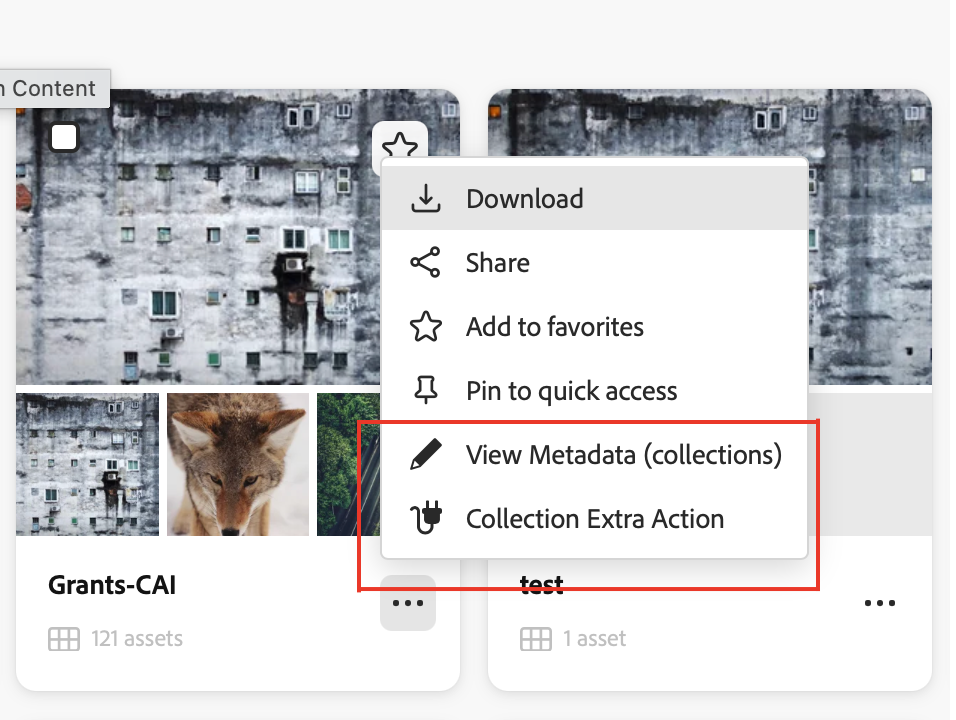

# Collection Card Actions

Content Hub lets extensions add custom action buttons to **collection tiles** — the cards shown on the Collections grid.



Collection card actions use the same `card` namespace as [Asset Card Actions](../asset-card/index.md). The surface is distinguished by the `context` value passed to each method:

| `context` value | Surface |
|---|---|
| `'collections'` | Collection tile on the Collections grid |
| `'assets'` | Asset card on the main Assets grid |
| `'collection'` | Asset card inside an open collection |
| `'share'` | Asset card in a link-share view |

When the clicked card is a collection tile, `onActionClick` receives `resourceType: 'collection'`.

## Extension API Reference

The `card` namespace methods are the same as documented in [Asset Card Actions](../asset-card/index.md). Filter by `context` to control which surfaces show your buttons.

## Example

This example adds a **Share Collection** button that appears only on collection tiles. It is registered in the same `card` block as any asset card actions — a single extension can handle both.

### `ExtensionRegistration.js` — registration

```js
import React from 'react';
import { Text } from '@adobe/react-spectrum';
import { register } from '@adobe/uix-guest';
import { extensionId } from './Constants';

function ExtensionRegistration() {
  const init = async () => {
    let guestConnection = await register({
      id: extensionId,
      methods: {
        card: {
          getActionButtons(actionContext) {
            const { context } = actionContext || {};

            // Button for collection tiles only
            if (context === 'collections') {
              return [
                {
                  id: 'share-collection',
                  label: 'Share Collection',
                  icon: 'Share',
                },
              ];
            }

            // Button for asset cards in the main grid and inside collections
            if (context === 'assets' || context === 'collection') {
              return [
                {
                  id: 'custom-export',
                  label: 'Custom Export',
                  icon: 'Export',
                },
              ];
            }

            return [];
          },

          async onActionClick(resourceType, buttonId, resourceId, actionContext) {
            if (buttonId === 'share-collection') {
              await guestConnection.host.modal.openDialog({
                title: 'Share Collection',
                contentUrl: `/#collection-modal?resourceId=${encodeURIComponent(resourceId)}&resourceType=${encodeURIComponent(resourceType)}`,
                type: 'modal',
                size: 'M',
              });
            }

            if (buttonId === 'custom-export') {
              await guestConnection.host.modal.openDialog({
                title: 'Custom Export',
                contentUrl: `/#card-action-modal?resourceId=${encodeURIComponent(resourceId)}&resourceType=${encodeURIComponent(resourceType)}`,
                type: 'modal',
                size: 'M',
              });
            }
          },
        },
      },
    });
  };

  init().catch(console.error);
  return <Text>IFrame for integration with Host (Content Hub)...</Text>;
}

export default ExtensionRegistration;
```

### `App.js` — routing

```js
import React from 'react';
import { ErrorBoundary } from 'react-error-boundary';
import { HashRouter as Router, Routes, Route } from 'react-router-dom';
import ExtensionRegistration from './ExtensionRegistration';
import CollectionModal from './CollectionModal';

function App() {
  return (
    <Router>
      <ErrorBoundary onError={onError} FallbackComponent={fallbackComponent}>
        <Routes>
          <Route index element={<ExtensionRegistration />} />
          <Route path="index.html" element={<ExtensionRegistration />} />
          <Route path="collection-modal" element={<CollectionModal />} />
        </Routes>
      </ErrorBoundary>
    </Router>
  );

  function onError(e, componentStack) {}
  function fallbackComponent({ componentStack, error }) {
    return (
      <React.Fragment>
        <h1 style={{ textAlign: 'center', marginTop: '20px' }}>Extension rendering error</h1>
        <pre>{componentStack + '\n' + error.message}</pre>
      </React.Fragment>
    );
  }
}

export default App;
```

### `CollectionModal.js` — dialog content

```js
import React, { useState, useEffect } from 'react';
import { attach } from '@adobe/uix-guest';
import {
  Provider,
  defaultTheme,
  View,
  Heading,
  Text,
  Button,
  ButtonGroup,
  Divider,
  ProgressCircle,
} from '@adobe/react-spectrum';
import { extensionId } from './Constants';

export default function CollectionModal() {
  const [guestConnection, setGuestConnection] = useState(null);
  const [payload, setPayload] = useState(null);

  useEffect(() => {
    (async () => {
      const connection = await attach({ id: extensionId });
      setGuestConnection(connection);

      const params = new URLSearchParams(window.location.hash.split('?')[1] || '');
      setPayload({
        resourceId: params.get('resourceId'),
        resourceType: params.get('resourceType'),
      });
    })();
  }, []);

  if (!payload) {
    return (
      <Provider theme={defaultTheme}>
        <View padding="size-400" height="100vh"
          UNSAFE_style={{ display: 'flex', justifyContent: 'center', alignItems: 'center' }}>
          <ProgressCircle aria-label="Loading..." isIndeterminate />
        </View>
      </Provider>
    );
  }

  return (
    <Provider theme={defaultTheme}>
      <View padding="size-400">
        <Heading level={3}>Share Collection</Heading>
        <Divider marginY="size-200" />
        <View marginBottom="size-300">
          <Text><strong>Collection ID:</strong></Text>
          <View marginTop="size-100" padding="size-100" backgroundColor="gray-100" borderRadius="regular">
            <Text UNSAFE_style={{ fontFamily: 'monospace', fontSize: '12px', wordBreak: 'break-all' }}>
              {payload.resourceId}
            </Text>
          </View>
        </View>
        <ButtonGroup>
          <Button variant="accent" onPress={() => {
            guestConnection?.host.toast.display({ variant: 'positive', message: 'Collection shared!' });
            guestConnection?.host.modal.closeDialog();
          }}>Share</Button>
          <Button variant="secondary" onPress={() => guestConnection?.host.modal.closeDialog()}>Cancel</Button>
        </ButtonGroup>
      </View>
    </Provider>
  );
}
```

## Additional resources

- [Common Concepts](../commons/index.md)
- [Asset Card Actions](../asset-card/index.md)
- [Step-by-step Extension Development](../../extension-development/index.md)
- [Troubleshooting](../../debug/index.md)
