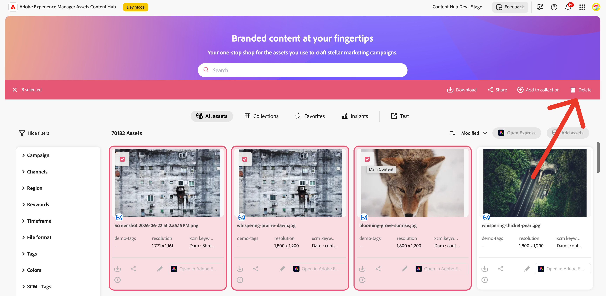

# Selection Bar Actions

Content Hub lets extensions add custom buttons to the **Selection Bar** — the bar that appears at the top of the screen when one or more assets are selected.



Selection Bar actions allow bulk operations: the extension receives the IDs of all selected assets when the button is clicked.

Extensions use the `aem/assets/contenthub/1` extension point and implement the `selectionBar` namespace inside a single `register()` call.

## Extension API Reference

### `selectionBar` namespace

#### `selectionBar.getActionButtons(actionContext)`

**Description:** Returns the list of custom buttons to add to the Selection Bar.

**Parameters:**
- `actionContext` (`object`):
  - `context` (`string`): The surface where assets are selected — `'assets'`, `'collection'`, `'collections'`, or `'share'`.
  - `resourceSelection` (`object`):
    - `resources` (`array`): Array of selected resource objects, each with an `id` property.

**Returns** (`array`): An array of button descriptor objects:
- `id` (`string`): Unique identifier for the button within the extension.
- `label` (`string`): Button label shown in the Selection Bar.
- `icon` (`string`): [React Spectrum workflow icon](https://react-spectrum.adobe.com/react-spectrum/workflow-icons.html#available-icons) name.

Return an empty array if no buttons should be shown.

#### `selectionBar.onActionClick(buttonId, assetIds)`

**Description:** Called by Content Hub when the user clicks a custom Selection Bar button.

**Parameters:**
- `buttonId` (`string`): The `id` of the button that was clicked.
- `assetIds` (`array`): Array of asset ID strings for all currently selected assets.

## Example

This example adds a **Bulk Export** button to the Selection Bar that opens a dialog showing all selected asset IDs.

### `App.js` — routing

```js
import React from 'react';
import { ErrorBoundary } from 'react-error-boundary';
import { HashRouter as Router, Routes, Route } from 'react-router-dom';
import ExtensionRegistration from './ExtensionRegistration';
import SelectionBarModal from './SelectionBarModal';

function App() {
  return (
    <Router>
      <ErrorBoundary onError={onError} FallbackComponent={fallbackComponent}>
        <Routes>
          <Route index element={<ExtensionRegistration />} />
          <Route path="index.html" element={<ExtensionRegistration />} />
          <Route path="selection-bar-modal" element={<SelectionBarModal />} />
        </Routes>
      </ErrorBoundary>
    </Router>
  );

  function onError(e, componentStack) {}
  function fallbackComponent({ componentStack, error }) {
    return (
      <React.Fragment>
        <h1 style={{ textAlign: 'center', marginTop: '20px' }}>Extension rendering error</h1>
        <pre>{componentStack + '\n' + error.message}</pre>
      </React.Fragment>
    );
  }
}

export default App;
```

### `ExtensionRegistration.js` — registration

```js
import React from 'react';
import { Text } from '@adobe/react-spectrum';
import { register } from '@adobe/uix-guest';
import { extensionId } from './Constants';

function ExtensionRegistration() {
  const init = async () => {
    let guestConnection = await register({
      id: extensionId,
      methods: {
        selectionBar: {
          getActionButtons(actionContext) {
            const { context } = actionContext || {};
            // Show button only on the main assets grid
            if (context !== 'assets') {
              return [];
            }
            return [
              {
                id: 'bulk-export',
                label: 'Bulk Export',
                icon: 'Export',
              },
            ];
          },
          async onActionClick(buttonId, assetIds) {
            if (buttonId === 'bulk-export') {
              await guestConnection.host.modal.openDialog({
                title: 'Bulk Export',
                contentUrl: `/#selection-bar-modal?assetIds=${encodeURIComponent(JSON.stringify(assetIds))}`,
                type: 'modal',
                size: 'M',
              });
            }
          },
        },
      },
    });
  };

  init().catch(console.error);
  return <Text>IFrame for integration with Host (Content Hub)...</Text>;
}

export default ExtensionRegistration;
```

### `SelectionBarModal.js` — dialog content

The assetIds are passed as a JSON-encoded URL parameter and decoded inside the dialog component.

```js
import React, { useState, useEffect } from 'react';
import { attach } from '@adobe/uix-guest';
import {
  Provider,
  defaultTheme,
  View,
  Heading,
  Text,
  Button,
  ButtonGroup,
  Divider,
  ListView,
  Item,
  ProgressCircle,
} from '@adobe/react-spectrum';
import { extensionId } from './Constants';

export default function SelectionBarModal() {
  const [guestConnection, setGuestConnection] = useState(null);
  const [payload, setPayload] = useState(null);

  useEffect(() => {
    (async () => {
      const connection = await attach({ id: extensionId });
      setGuestConnection(connection);

      // assetIds are passed as a JSON-encoded URL parameter
      const params = new URLSearchParams(window.location.hash.split('?')[1] || '');
      const raw = params.get('assetIds');
      setPayload({
        assetIds: raw ? JSON.parse(decodeURIComponent(raw)) : [],
      });
    })();
  }, []);

  if (!payload) {
    return (
      <Provider theme={defaultTheme}>
        <View padding="size-400" height="100vh"
          UNSAFE_style={{ display: 'flex', justifyContent: 'center', alignItems: 'center' }}>
          <ProgressCircle aria-label="Loading..." isIndeterminate />
        </View>
      </Provider>
    );
  }

  const handleExport = async () => {
    // Add your bulk export logic here
    await guestConnection?.host.toast.display({
      variant: 'positive',
      message: `Exported ${payload.assetIds.length} asset(s)`,
    });
    guestConnection?.host.modal.closeDialog();
  };

  return (
    <Provider theme={defaultTheme}>
      <View padding="size-400">
        <Heading level={3}>Bulk Export — {payload.assetIds.length} asset(s) selected</Heading>
        <Divider marginY="size-200" />
        <ListView
          items={payload.assetIds.map((id) => ({ id, name: id }))}
          height="size-2400"
          aria-label="Selected assets"
        >
          {(item) => (
            <Item key={item.id}>
              <Text UNSAFE_style={{ fontFamily: 'monospace', fontSize: '12px' }}>{item.name}</Text>
            </Item>
          )}
        </ListView>
        <ButtonGroup marginTop="size-300">
          <Button variant="accent" onPress={handleExport}>Export All</Button>
          <Button variant="secondary" onPress={() => guestConnection?.host.modal.closeDialog()}>Cancel</Button>
        </ButtonGroup>
      </View>
    </Provider>
  );
}
```

## Additional resources

- [Common Concepts](../commons/index.md)
- [Step-by-step Extension Development](../../extension-development/index.md)
- [Troubleshooting](../../debug/index.md)
