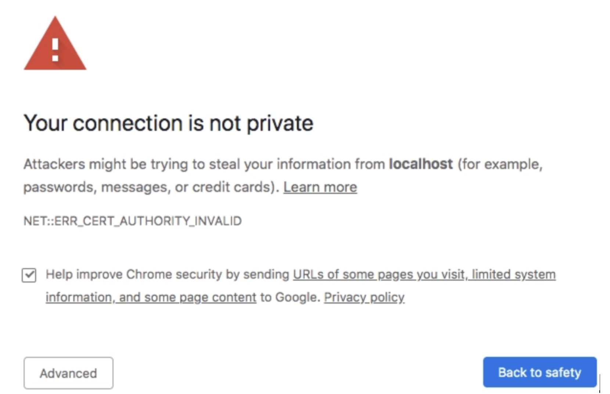
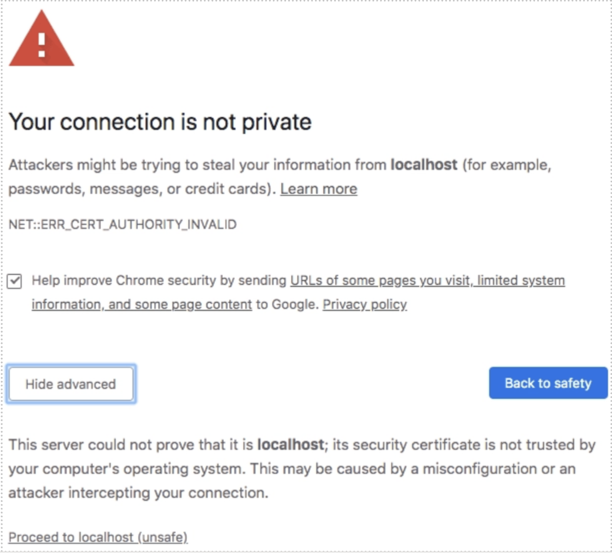

# Troubleshooting - Content Hub Extensibility

Fast feedback is essential for development. You can connect a locally running Content Hub extension to the production Content Hub environment to see your changes immediately without deploying.

## Running in a local environment

There are two ways to run an extension locally:

### Option 1: Complete local isolation

Both the extension UI and serverless actions run on your machine.

```shell
➜  my-contenthub-extension % aio app dev
```

```shell
To view your local application:
  -> https://localhost:9080
To view your deployed application in the Experience Cloud shell:
  -> https://experience.adobe.com/?devMode=true#/custom-apps/?localDevUrl=https://localhost:9080
Your actions:
web actions:
  -> https://localhost:9080/api/v1/web/aem-assets-contenthub-1/my-action
press CTRL+C to terminate the dev environment
```

### Option 2: Local UI, cloud actions

The extension UI runs locally; serverless actions are deployed to Adobe I/O Runtime.

```shell
➜  my-contenthub-extension % aio app run
```

```shell
For a developer preview of your UI extension in the Content Hub environment, follow the URL:
  -> https://experience.adobe.com/aem/extension-manager/preview/<preview hash>
  
To view your local application:
  -> https://localhost:9080
To view your deployed application in the Experience Cloud shell:
  -> https://experience.adobe.com/?devMode=true#/custom-apps/?localDevUrl=https://localhost:9080
press CTRL+C to terminate dev environment
```

### Extension endpoint

The local extension is served at the URL shown next to `To view your local application` — typically `https://localhost:9080`. You will use this URL to load the extension in Content Hub.

## Accept the Certificate

The first time you run the extension locally, you will see:

```shell
success: generated certificate
A self signed development certificate has been generated, you will need to accept it in your browser in order to use it.
Waiting for the certificate to be accepted....
```

1. Navigate to `https://localhost:9080` in Google Chrome.



2. Click **Advanced**, then click **Proceed to localhost (unsafe)**.



In Chrome you can also type `thisisunsafe` on the warning page to bypass it. Refer to your browser's documentation for other browsers.

3. Exit the running process and run `aio app run` again.

## Load UI Extension

Once the extension is running locally, embed it in Content Hub:

1. Navigate to Content Hub: `https://experience.adobe.com/#/assets/contenthub`
2. Append the following query parameters to the URL:
   - `devMode=true` — tells Adobe Experience Shell to allow content from localhost.
   - `ext=<extension_endpoint_url>` — the full URL of your local extension.
3. Press Enter to reload Content Hub with the extension loaded.

**Example URL:**

```text
https://experience.adobe.com/?devMode=true&ext=https://localhost:9080#/assets/contenthub
```

You can specify multiple `ext=` parameters to load more than one extension simultaneously:

```text
https://experience.adobe.com/?devMode=true&ext=https://localhost:9080&ext=https://localhost:9081#/assets/contenthub
```

### `ext=` query parameter syntax

The full syntax of the `ext=` parameter is:

```text
ext.<ExtensionPointId>=<url>[,<url>]
```

For Content Hub, the extension point ID is `aem/assets/contenthub/1`. URL-encoded:

```text
ext.aem%2fassets%2fcontenthub%2f1=https://localhost:9080
```

Using the shorthand `ext=<url>` (without specifying the extension point) applies the extension to all available extension points:

```text
ext=https://localhost:9080
```

## Common issues

### The extension panel or action does not appear

- Verify you accepted the self-signed certificate at `https://localhost:9080`.
- Check that `devMode=true` is in the URL.
- Open the browser DevTools console and look for errors from the UIX SDK (messages prefixed with `[uix]`).
- Confirm your `register()` call specifies the correct namespace and method names (e.g. `assetDetails.getTabPanels`).

### Toast or modal does not appear

- Ensure the component called `attach()` to connect to Content Hub.
- All `host.*` API calls are asynchronous; make sure you are awaiting the promises where required.

### `register()` is never called

- Check your `App.js` routes — the route that renders `ExtensionRegistration` must match the URL loaded in the iframe (typically the index route).

## Additional resources

- [Step-by-step Extension Development](../extension-development/index.md)
- [UI Extensions Development Flow](../../../guides/development-flow/index.md)
- [FAQ](../../../getting-started/faq/index.md)
