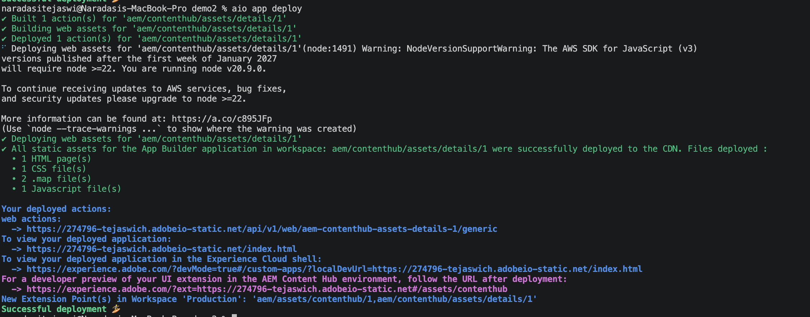

# Step-by-step Extension Development

This guide walks through building a complete Content Hub extension that implements all three extension surfaces — **Asset Details tab panel**, **asset card actions**, and **Selection Bar actions** — in a single extension. By the end you will have a working extension running locally, tested against a live Content Hub environment, and deployed to Stage.

## About the extension

The extension built in this guide adds:
- A custom **tab panel** to the Asset Details dialog showing the current asset's ID
- A **Custom Action** button on asset cards (shown in the Assets grid and inside collections)
- A **Bulk Action** button in the Selection Bar for bulk operations on selected assets

The extension demonstrates how all three surfaces are registered in a single `register()` call and how modal data is passed via URL query parameters.

## Create a project in Adobe Developer Console

UI Extensions are represented as projects in [Adobe Developer Console](https://developer.adobe.com/developer-console/docs/guides/).

<InlineAlert slots="text" />

If you don't have access to Adobe Developer Console, refer to the [How to Get Access](../../../guides/get-access/index.md) guide.

1. Sign in to [Adobe Developer Console](https://developer.adobe.com/console) with your Adobe ID.
2. Make sure you are in the correct organization (switcher in the top right corner).
3. Click **Create new project** → **Project from template** → **App Builder**.
4. Fill in **Project Title** (display name) and **App Name** (unique identifier — cannot be changed after creation).

After creating, you will see a project with two default workspaces: **Production** and **Stage**. Use **Stage** for development and testing before pushing to Production.

## Set up local environment

Make sure you have the correct Node.js version and the latest AIO CLI installed.

```shell
$ node -v
v20.9.0
```

Check your AIO CLI version:

```shell
aio -v
```

Compare it with the latest published version:

```shell
npm show @adobe/aio-cli version
```

If outdated, update:

```shell
npm install -g @adobe/aio-cli
```

More details: [Local Environment Set Up](../../../guides/local-environment/index.md).

## Step 1: Get the sample project

The quickest way to start is to clone the official Content Hub sample from [adobe/aem-uix-examples](https://github.com/adobe/aem-uix-examples):

```shell
git clone https://github.com/adobe/aem-uix-examples.git
cd aem-uix-examples/aem-contenthub-sample
npm install
```

Then log in to Adobe I/O and link the project to your Console workspace:

```shell
aio login
aio console org select
aio console project select
aio console workspace select
aio app use -g
```

See [Code Generation](../code-generation/index.md) for the full setup walkthrough.

## Step 2: Project structure

After scaffolding, the relevant files are:

```text
app.config.yaml
src/
  aem-assets-contenthub-1/
    ext.config.yaml
    web-src/
      src/
        components/
          App.js
          Constants.js
          ExtensionRegistration.js
          TabPanel.js
          CardActionModal.js
          SelectionBarModal.js
```

```yaml
# app.config.yaml
extensions:
  aem/assets/contenthub/1:
    $include: src/aem-assets-contenthub-1/ext.config.yaml
```

## Step 3: Wire up routing in `App.js`

`App.js` maps URL hash paths to React components. Each modal or panel is a separate route. Content Hub loads the extension in an iframe and navigates between routes to render panels and dialogs.

```js
import React from 'react';
import { ErrorBoundary } from 'react-error-boundary';
import { HashRouter as Router, Routes, Route } from 'react-router-dom';
import ExtensionRegistration from './ExtensionRegistration';
import TabPanel from './TabPanel';
import CardActionModal from './CardActionModal';
import SelectionBarModal from './SelectionBarModal';

function App() {
  return (
    <Router>
      <ErrorBoundary onError={onError} FallbackComponent={fallbackComponent}>
        <Routes>
          <Route index element={<ExtensionRegistration />} />
          <Route path="index.html" element={<ExtensionRegistration />} />
          <Route path="tab-panel" element={<TabPanel />} />
          <Route path="card-action-modal" element={<CardActionModal />} />
          <Route path="selection-bar-modal" element={<SelectionBarModal />} />
          {/* YOUR CUSTOM ROUTES SHOULD BE HERE */}
        </Routes>
      </ErrorBoundary>
    </Router>
  );

  function onError(e, componentStack) {}
  function fallbackComponent({ componentStack, error }) {
    return (
      <React.Fragment>
        <h1 style={{ textAlign: 'center', marginTop: '20px' }}>Extension rendering error</h1>
        <pre>{componentStack + '\n' + error.message}</pre>
      </React.Fragment>
    );
  }
}

export default App;
```

## Step 4: Register all surfaces in `ExtensionRegistration.js`

This is the core of the extension. `ExtensionRegistration.js` calls `register()` from `@adobe/uix-guest`, which connects to Content Hub and announces the extension's capabilities.

All three namespaces (`assetDetails`, `card`, `selectionBar`) are declared in a single `register()` call. Use `let` for `guestConnection` so that click handlers defined inside `card` and `selectionBar` can close over it after `register()` resolves.

For production, populate `allowedRepos` to restrict the extension to your specific Content Hub repository. Leave it empty during development to allow any repository.

```js
import React from 'react';
import { Text } from '@adobe/react-spectrum';
import { register } from '@adobe/uix-guest';
import { extensionId } from './Constants';

// Populate before deploying to Production. Empty = allow any repo (safe for dev).
const allowedRepos = [];

function getRepo() {
  return new URLSearchParams(window.location.search).get('repo');
}

function shouldSkipRegistration(repo) {
  return allowedRepos.length > 0 && !allowedRepos.includes(repo);
}

function ExtensionRegistration() {
  const repo = getRepo();
  if (shouldSkipRegistration(repo)) {
    return <Text>Skipped registration: repo not in allowedRepos</Text>;
  }

  const init = async () => {
    let guestConnection = await register({
      id: extensionId,
      methods: {

        // ── Asset Details tab panel ──────────────────────────────────────
        assetDetails: {
          getTabPanels() {
            return [
              {
                id: 'tab-panel',
                tooltip: 'My Custom Tab',
                icon: 'Extension',
                title: 'My Custom Tab',
                contentUrl: '/#tab-panel',
              },
            ];
          },
        },

        // ── Asset card & collection tile actions ─────────────────────────
        card: {
          getActionButtons(actionContext) {
            const { context } = actionContext || {};
            if (context === 'assets' || context === 'collection') {
              return [{ id: 'custom-export', label: 'Custom Export', icon: 'Export' }];
            }
            if (context === 'collections') {
              return [{ id: 'share-collection', label: 'Share Collection', icon: 'Share' }];
            }
            return [];
          },
          async onActionClick(resourceType, buttonId, resourceId, actionContext) {
            if (buttonId === 'custom-export') {
              await guestConnection.host.modal.openDialog({
                title: 'Custom Export',
                contentUrl: `/#card-action-modal?resourceId=${encodeURIComponent(resourceId)}&resourceType=${encodeURIComponent(resourceType)}`,
                type: 'modal',
                size: 'M',
              });
            }
            if (buttonId === 'share-collection') {
              // Reuses CardActionModal for simplicity. In a real extension, create a separate CollectionModal component.
              await guestConnection.host.modal.openDialog({
                title: 'Share Collection',
                contentUrl: `/#card-action-modal?resourceId=${encodeURIComponent(resourceId)}&resourceType=${encodeURIComponent(resourceType)}`,
                type: 'modal',
                size: 'M',
              });
            }
          },
        },

        // ── Selection Bar bulk actions ────────────────────────────────────
        selectionBar: {
          getActionButtons(actionContext) {
            const { context } = actionContext || {};
            if (context !== 'assets') return [];
            return [{ id: 'bulk-export', label: 'Bulk Export', icon: 'Export' }];
          },
          async onActionClick(buttonId, assetIds) {
            if (buttonId === 'bulk-export') {
              await guestConnection.host.modal.openDialog({
                title: 'Bulk Export',
                contentUrl: `/#selection-bar-modal?assetIds=${encodeURIComponent(JSON.stringify(assetIds))}`,
                type: 'modal',
                size: 'M',
              });
            }
          },
        },

      },
    });
  };

  init().catch(console.error);
  return <Text>IFrame for integration with Host (Content Hub)...</Text>;
}

export default ExtensionRegistration;
```

## Step 5: Build the tab panel — `TabPanel.js`

The tab panel is a separate component rendered inside an iframe when the user clicks the custom tab. It calls `attach()`  to connect to Content Hub and retrieves the current asset.

`getCurrentAsset()` is asynchronous and returns a plain string (the asset URN). Normalize it to `{ id }` so the rest of your code works consistently regardless of future API changes.

```js
import React, { useState, useEffect } from 'react';
import { attach } from '@adobe/uix-guest';
import {
  Provider, defaultTheme, View, Heading, Text, Button, Divider, ProgressCircle,
} from '@adobe/react-spectrum';
import { extensionId } from './Constants';

export default function TabPanel() {
  const [guestConnection, setGuestConnection] = useState(null);
  const [asset, setAsset] = useState(null);
  const [loading, setLoading] = useState(true);

  useEffect(() => {
    (async () => {
      try {
        const connection = await attach({ id: extensionId });
        setGuestConnection(connection);

        // getCurrentAsset() returns a plain string (the asset URN).
        // Normalize to { id } for consistent downstream usage.
        const currentAssetId = await connection.host.assetDetails.getCurrentAsset();
        const currentAsset = typeof currentAssetId === 'string'
          ? { id: currentAssetId }
          : currentAssetId;
        setAsset(currentAsset);
      } finally {
        setLoading(false);
      }
    })();
  }, []);

  if (loading) {
    return (
      <Provider theme={defaultTheme}>
        <View padding="size-400" height="100vh"
          UNSAFE_style={{ display: 'flex', justifyContent: 'center', alignItems: 'center' }}>
          <ProgressCircle aria-label="Loading..." isIndeterminate />
        </View>
      </Provider>
    );
  }

  return (
    <Provider theme={defaultTheme}>
      <View padding="size-400">
        <Heading level={3}>My Custom Tab</Heading>
        <Divider marginY="size-200" />
        {asset && (
          <View marginBottom="size-200">
            <Text><strong>Asset ID:</strong></Text>
            <View marginTop="size-100" padding="size-100" backgroundColor="gray-100" borderRadius="regular">
              <Text UNSAFE_style={{ fontFamily: 'monospace', fontSize: '12px', wordBreak: 'break-all' }}>
                {asset.id}
              </Text>
            </View>
          </View>
        )}
        <Button
          variant="accent"
          marginTop="size-300"
          onPress={() => guestConnection?.host.toast.display({ variant: 'positive', message: 'Hello from My Custom Tab!' })}
        >
          Show Toast
        </Button>
      </View>
    </Provider>
  );
}
```

## Step 6: Build the card action modal — `CardActionModal.js`

The card action modal is opened when the user clicks a custom card button. Data (the asset or collection ID and resource type) is passed via URL query parameters embedded in `contentUrl` and read from the URL hash inside the dialog component.

Note that `payload` will be `null` on the very first render and set on the second render after the URL params are parsed — show a spinner until it's ready.

```js
import React, { useState, useEffect } from 'react';
import { attach } from '@adobe/uix-guest';
import {
  Provider, defaultTheme, View, Heading, Text, Button, ButtonGroup, Divider, ProgressCircle,
} from '@adobe/react-spectrum';
import { extensionId } from './Constants';

export default function CardActionModal() {
  const [guestConnection, setGuestConnection] = useState(null);
  const [payload, setPayload] = useState(null);

  useEffect(() => {
    (async () => {
      const connection = await attach({ id: extensionId });
      setGuestConnection(connection);

      // Data is passed via URL query parameters embedded in contentUrl.
      const params = new URLSearchParams(window.location.hash.split('?')[1] || '');
      setPayload({
        resourceId: params.get('resourceId'),
        resourceType: params.get('resourceType'),
      });
    })();
  }, []);

  if (!payload) {
    return (
      <Provider theme={defaultTheme}>
        <View padding="size-400" height="100vh"
          UNSAFE_style={{ display: 'flex', justifyContent: 'center', alignItems: 'center' }}>
          <ProgressCircle aria-label="Loading..." isIndeterminate />
        </View>
      </Provider>
    );
  }

  return (
    <Provider theme={defaultTheme}>
      <View padding="size-400">
        <Heading level={3}>Custom Export</Heading>
        <Divider marginY="size-200" />
        <View marginBottom="size-300">
          <Text><strong>Type:</strong> {payload.resourceType}</Text>
          <View marginTop="size-100" padding="size-100" backgroundColor="gray-100" borderRadius="regular">
            <Text UNSAFE_style={{ fontFamily: 'monospace', fontSize: '12px', wordBreak: 'break-all' }}>
              {payload.resourceId}
            </Text>
          </View>
        </View>
        <ButtonGroup>
          <Button variant="accent" onPress={async () => {
            await guestConnection?.host.toast.display({ variant: 'positive', message: 'Exported!' });
            guestConnection?.host.modal.closeDialog();
          }}>Export</Button>
          <Button variant="secondary" onPress={() => guestConnection?.host.modal.closeDialog()}>Cancel</Button>
        </ButtonGroup>
      </View>
    </Provider>
  );
}
```

## Step 7: Build the selection bar modal — `SelectionBarModal.js`

The selection bar modal receives a list of selected asset IDs passed as a JSON-encoded URL parameter. Decode and parse them inside the component.

```js
import React, { useState, useEffect } from 'react';
import { attach } from '@adobe/uix-guest';
import {
  Provider, defaultTheme, View, Heading, Text, Button, ButtonGroup, Divider,
  ListView, Item, ProgressCircle,
} from '@adobe/react-spectrum';
import { extensionId } from './Constants';

export default function SelectionBarModal() {
  const [guestConnection, setGuestConnection] = useState(null);
  const [payload, setPayload] = useState(null);

  useEffect(() => {
    (async () => {
      const connection = await attach({ id: extensionId });
      setGuestConnection(connection);

      // assetIds are passed as a JSON-encoded URL parameter.
      const params = new URLSearchParams(window.location.hash.split('?')[1] || '');
      const raw = params.get('assetIds');
      setPayload({ assetIds: raw ? JSON.parse(raw) : [] });
    })();
  }, []);

  if (!payload) {
    return (
      <Provider theme={defaultTheme}>
        <View padding="size-400" height="100vh"
          UNSAFE_style={{ display: 'flex', justifyContent: 'center', alignItems: 'center' }}>
          <ProgressCircle aria-label="Loading..." isIndeterminate />
        </View>
      </Provider>
    );
  }

  return (
    <Provider theme={defaultTheme}>
      <View padding="size-400">
        <Heading level={3}>Bulk Export — {payload.assetIds.length} asset(s) selected</Heading>
        <Divider marginY="size-200" />
        <ListView
          items={payload.assetIds.map((id) => ({ id, name: id }))}
          height="size-2400"
          aria-label="Selected assets"
        >
          {(item) => (
            <Item key={item.id}>
              <Text UNSAFE_style={{ fontFamily: 'monospace', fontSize: '12px' }}>{item.name}</Text>
            </Item>
          )}
        </ListView>
        <ButtonGroup marginTop="size-300">
          <Button variant="accent" onPress={async () => {
            await guestConnection?.host.toast.display({ variant: 'positive', message: `Exported ${payload.assetIds.length} asset(s)` });
            guestConnection?.host.modal.closeDialog();
          }}>Export All</Button>
          <Button variant="secondary" onPress={() => guestConnection?.host.modal.closeDialog()}>Cancel</Button>
        </ButtonGroup>
      </View>
    </Provider>
  );
}
```

## Step 8: Test locally

Run the extension and load it in Content Hub. See [Troubleshooting](../debug/index.md) for certificate setup and common issues.

```shell
aio app run
```

```shell
For a developer preview of your UI extension in the Content Hub environment, follow the URL:
  -> https://experience.adobe.com/aem/extension-manager/preview/<preview hash>

To view your local application:
  -> https://localhost:9080
press CTRL+C to terminate dev environment
```

Open Content Hub with the `ext=` parameter to load your locally running extension:

```text
https://experience.adobe.com/?devMode=true&ext=https://localhost:9080#/assets/contenthub/
```

You may need to accept the self-signed certificate first — see [Accept the Certificate](../debug/index.md#accept-the-certificate).

## Step 9: Run on Stage

After development is complete, test on Stage before deploying to Production. First, ensure you are logged into the correct org and using the Stage workspace:

```shell
$ aio where

You are currently in:
1. Org: My Org
2. Project: my-contenthub-extension
3. Workspace: Stage
```

Then deploy:

```shell
aio app deploy
✔ Building web assets for 'aem/assets/contenthub/1'
✔ Deploying web assets for 'aem/assets/contenthub/1'
To view your deployed application:
  -> https://123456-yournamespace-stage.adobeio-static.net/index.html
For a developer preview of your UI extension in the Content Hub environment, follow the URL:
  -> https://experience.adobe.com/aem/extension-manager/preview/<preview hash>
New Extension Point(s) in Workspace 'Stage': 'aem/assets/contenthub/1'
Successful deployment 🏄
```

Use the staging deployment URL with the `ext=` parameter to verify the extension in Content Hub:

```text
https://experience.adobe.com/?devMode=true&ext=https://123456-yournamespace-stage.adobeio-static.net/index.html#/assets/contenthub/
```



## Step 10: Deploy to Production

After testing on Stage, populate `allowedRepos` in `ExtensionRegistration.js` with your production Content Hub repository hostname:

```js
const allowedRepos = [
  'delivery-p12345-e167890.adobeaemcloud.com',
];
```

Then redeploy using the Production workspace and publish through the Extension Manager.

Refer to [UI Extensions Development Flow](../../../guides/development-flow/index.md#deploy-on-production) for the full publication and approval process.

## Additional resources

- [Common Concepts](../api/commons/index.md)
- [Asset Card Actions](../api/asset-card/index.md)
- [Asset Details Tab Panels](../api/asset-details/index.md)
- [Selection Bar Actions](../api/selection-bar/index.md)
- [Code Generation](../code-generation/index.md)
- [Troubleshooting](../debug/index.md)
- [UI Extensions Development Flow](../../../guides/development-flow/index.md)
- [UI Extensions Management](../../../guides/publication/index.md)
